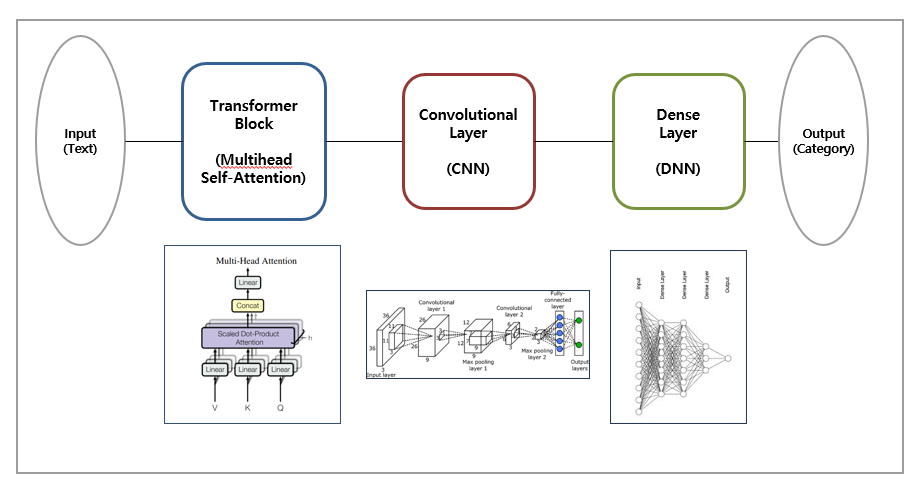
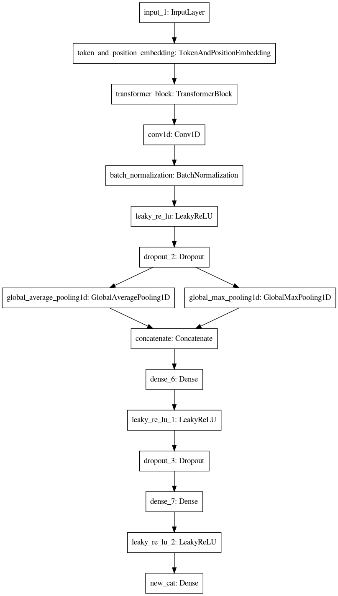

Transformer based product categorization model
==============================================

Given a product name in text, classify its category using NLP transformer based categorization model.

Contents
--------

1.	[Datasets](#datasets)
2.	[Structure](#structure)
3.	[Tokenizer](#tokenizer)
4.	[Modules](#modules)
5.	[Results](#results)

Dataset
-------

-	Dataset contains more than 1.2 million product name and its label.
-	The number of category label is 3827.
-	Due to confidentiality reasons, the dataset is not available.

### Structure

The overview of the model structure will be illustrated below.



### Tokenizer

In this model, BPE(Byte Pair Encoding) tokenization method is used. Google provides inofficial package named [sentencepiece](https://github.com/google/sentencepiece).<p> BPE splits texts into subword tokens, based on frequency in the text. It makes a vocabulary list of specified number (vocab_size), and in this project I used 40,000 for the vocab_size.

[Example] 

For more detailed explanation on BPE and WPM(Word Piece Model), please check this post (In Korean) : https://lovit.github.io/nlp/2018/04/02/wpm/

### Modules

In this repo, there are 4 main parts used to build the categorization model. 1) Preprocessor 2) Spm trainer 3) Deep learning model structure (transformer using keras) 4) Prediction

##### 1. Preprocessor

textPreprocessor.py

This module is implemented to preprocess text data to make it into a clear text form as the data used in training session. It contains removing punctuation, separating words written in Korean and English, etc.

##### 2. Spm trainer

2_spm_training.ipynb

SPM trainer contains codes used to train BPE model. hyperparameters used are listed below:

```bash

templates= "--input={} \
--pad_id={} \
--vocab_size={} \
--model_prefix={} \
--bos_id={} \
--eos_id={} \
--unk_id={} \
--character_coverage={} \
--model_type={}"


train_input_file = "sentencepiece_trsfm.txt"
pad_id=0                          
vocab_size = "40000"                
prefix = "sentencepiece"           
bos_id=1                          
eos_id=2                          
unk_id=3                          
character_coverage = "0.9995"           
model_type ="bpe"             

```

##### 3. Deep learning model structure

textClassfierModel.py

Model structure is defined in the module.

<p align="center">

##### 4. Prediction

1_executePrediction.ipynb

preprocessing and spm-encoding are executed in this part. the trained neural network weights are loaded and it is used to make prediction on the tokens of the given texts.

|          | question sentences                                                             |
|----------|:------------------------------------------------------------------------------:|
| Japanese | [questions.ja](data/questions_jaen.ja), [questions.en](data/questions_jaen.en) |
| French   | [questions.fr](data/questions_fren.fr), [questions.en](data/questions_jaen.en) |

Results
-------

Transformer based model outperforms the baseline model using Bidirectional LSTM and Convolutional Network. please note that CNN layer is applied to the transformer based model as well.

| methods                 | Accuracy  |
|-------------------------|:---------:|
| Transformer based model | **92.14** |
| BiLSTM+CNN              |   90.47   |
